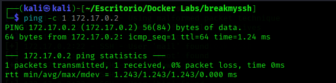
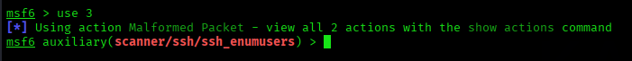
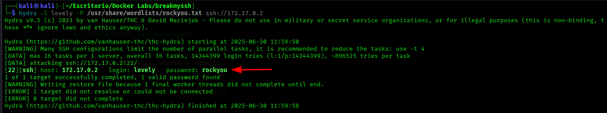
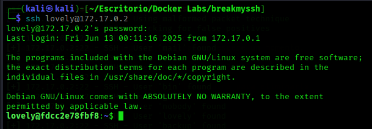
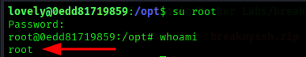

# BreakMySSH

## 📄 Información
**Maquina**: BreakMySSH  
**Objetibo**: Acceso root  
**Descripción**: Máquina vulnerable desplegada con `Docker` que explota un `SSH`

## ⚙️ Despliegue de la Máquina
1- Vamos a descargar el zip de la plataforma **DockerLabs**  
2- Extraemos la máquina vulnerable con el comando `unzip`  
3- Desplegamos la máquina con el comando `sudo bash auto_deploy.sh breakmyssh.tar`  
  

## 📶 Testeo de Conectividad
Verificamos la conectividad con la máquina mediante ping:  
  

## 🔍 Escaneo de puertos con Nmap
Realizamos un Eecaneo completo de puertos.  
  
Hallazgos:
- Puerto `22/tcp` **SSH** Servicio **OpenSSH 7.7**

## 💣 Enumeración de usuarios con Metasploit
Como no tenemos usuarios hacemos una búsqueda con `Metasploit` y vemos que la versión `OpenSSH` es vulnerable a una enumeración de usuarios.
  
Seleccionamos el modulo 3 `auxiliary/scanner/ssh/ssh_enumusers`.  
  
Configuramos el `RHOSTS`, `USER_FILE` y lo executamos con el comando `run`.  
  
Tras enumerar los usuarios `SSH` disponibles, identificamos varias cuentas del sistema y un usuario destacado: `lovely`. Este usuario no convencional sugiere que podría ser el objetivo.  
  ++++++++++++++++++++++++++++++++

## 🧠 Fuerza bruta con Hydra
Procedemos a realizar un ataque de fuerza bruta haciendo uso de `Hydra` con el usuario `lovely`.  
  
Credenciales comprometidas: 
- Login: **lovely**
- password: **rockyou**

## 📥 Acceso inicial SSH
Nos logueamos al sistema con el usuario y contraseña encontrados anteriormente.  
  

## 🔐 Privilegios
Para dominar el sistema debemos de hacer **escalada de privilegios** ya que aun no somos usuario `root`, somos el usuario `lovely`.  
Al no encontrar información relevante inicialmente, inspeccionamos el directorio `/opt` donde logramos descubrir un archivo oculto. (`.hash`).  
  
Haciendo uso de herramientas como **[CrackStatioin](https://crackstation.net/)** podemos descifrar el `hash`.
  
Resultado:
- Password: **estrella**.  

Finalmente hemos conseguido el acceso `root`.   
  

## ✅ Conclusión
- **Acceso inicial**: Enumeración de usuarios con `Metasploit` + fuerza bruta con `Hydra` (Credenciales: `lovely:rockyou`).
- **Escalada**: 
    - `lovely` → `root` (contraseña `estrella` en un `hash` oculto en `/opt`). 
- 🎯 **Objetivo obtenido**: Shell de `root` obtenida.