# Stellarjwt

## 📄 Información
- **Máquina**: Stellarjwt.
- **Objetivo**: Acceso root.
- **Descripción**: Máquina vulnerable desplegada con **Docker** que explota vulnerabilidades en **JWT (JSON Web Tokens)** para lograr acceso root.

## ⚙️ Despliegue de la Máquina
1- Vamos a descargar el zip de la plataforma **DockerLabs**
2- Extraemos la máquina vulnerable con el comando `unzip`
3- Desplegamos la máquina con el comando
```bash
sudo bash auto_deploy.sh stellarjwt.tat
```
  

## 📶 Testeo de Conectividad
Verificamos la conectividad con la máquina mediante ping:  
  

## 🔍 Escaneo de puertos con Nmap
Realizamos un escaneo completo de puertos.  
  
Hallazgos:
- Puerto **22/tcp** **SSH** Servicio **OpenSSH 9.6p1**
- Puerto **80/tcp** **HTTP** Servicio **Apache httpd 2.4.58**

## 🌐 Acceso al servidor web
Accedemos mediante el navegador a la dirección **172.17.0.2**.  
En la página nos encontramos con la frase **¿Qué astrónomo alemán descubrió Neptuno?**.  
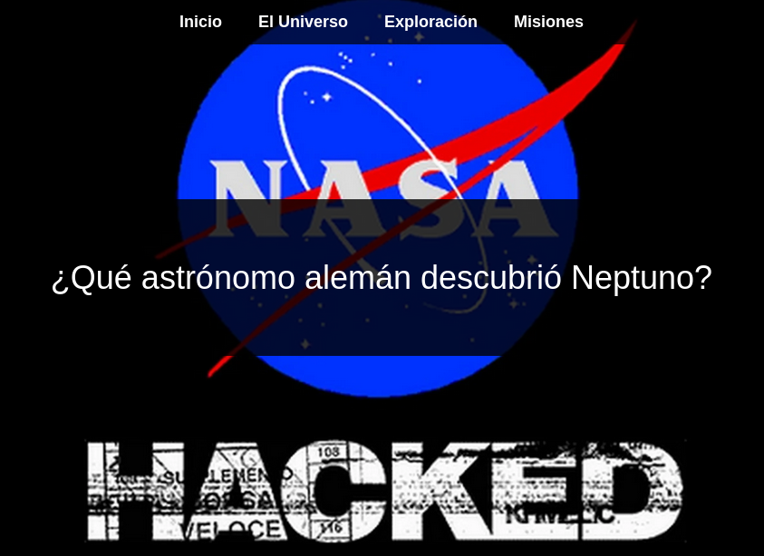  
Ante la pregunta mostrada en la página, realizamos una búsqueda en **Google** confirmando que el astrónomo fue **Johann Gottfried Galle**.  
Este nombre lo guardamos como una lista en un archivo para uso posterior en fases de explotación.

## 🔍 Enumeración con Gobuster
Además de la investigación manual, podemos realizar un escaneo con **Gobuster** para descubrir rutas ocultas o directorios sensibles:
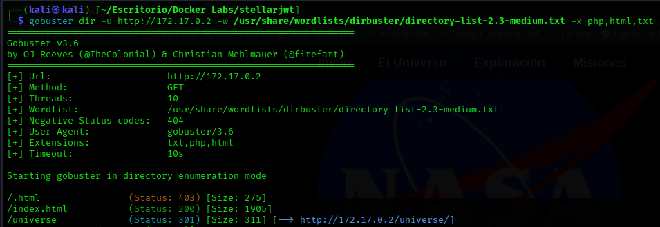  
Hallazgos:
Al utilizar **Gobuster** logramos encontrar la ruta `/universe`

## 🔑 Detección de JWT
Al acceder a la ruta podemos ver una imagen de una galaxia, pero si inspeccionamos el código fuente de la página identificamos un **JSON Web Token (JWT)**.  
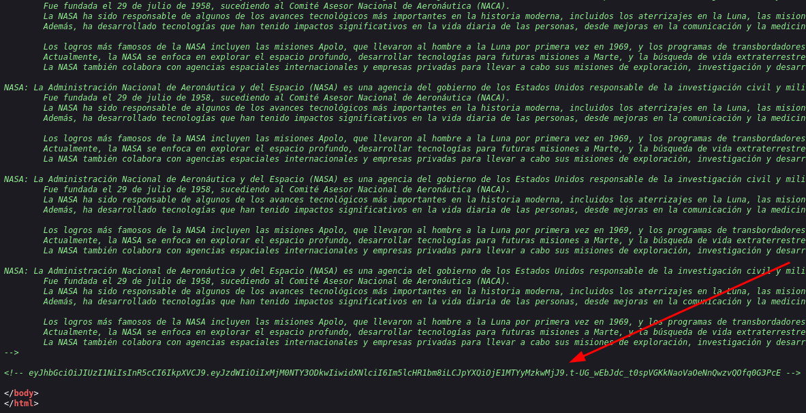  
Podemos utilizar páginas como: **[jwt.io](https://jwt.io)** o **[CyberChef](https://gchq.github.io/CyberChef/)** para analizar el token obtenido.
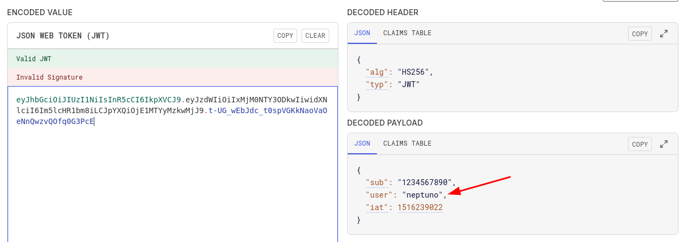  

## 🧠 Fuerza bruta con Hydra
Recordemos que la pregunta de la página web de inicio era: **¿Qué astrónomo alemán descubrió Neptuno?** y su respuesta es: **Johann Gottfried Galle** la cual guardamos como una lista en un archivo de texto.  
Ahora, realizamos fuerza bruta haciendo uso de `Hydra` con el usuario decodificado del token **JWT** y el archivo que guardamos anteriormente. 
    
Hallazgos:
- Login: `neptuno`
- password: `Gottfried`

## 📥 Acceso inicial SSH
Nos logueamos al sistema con el usuario y contraseña encontrados anteriormente.  
  

## 🔐 Privilegios
Para dominar el sistema debemos de hacer **escalada de privilegios** ya que aun no somos usuario **root**, somos el usuario **neptuno**.
Lo primero que hacemos es probar el comando `sudo -l` que sirve para listar los privilegios que tiene un usuario con `sudo`, pero vemos que no funciona, así que nos dirigimos a la ruta `/etc/passwd` para observar qué usuarios existen actualmente en el sistema.  
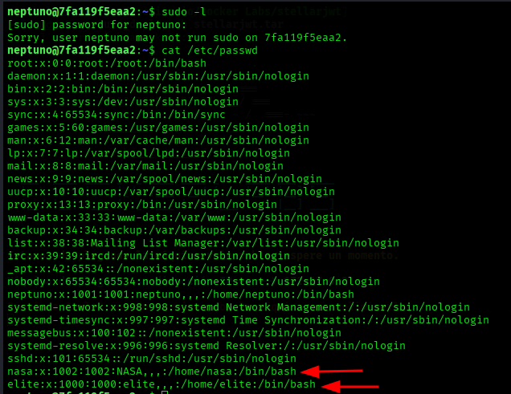  
Observamos que hay 2 usuarios `nasa` y `elite`.  

Si observamos lo que tenemos es nuestro directorio actual `Desktop` podemos encontrar un archivo oculto llamado `.carta_a_la_Nasa.txt`, al abrirlo encontramos un texto que habla sobre la **Nasa** que es el tema principal y el nombre **Eisenhower**.
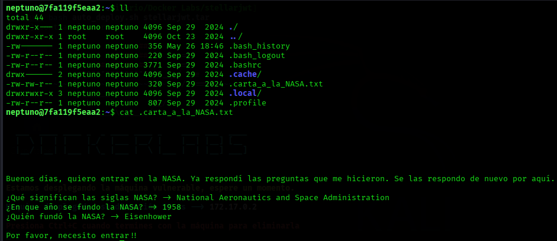   
Intentamos acceder al usuario **nasa** con la contraseña de **Eisenhower** y vemos que tendremos éxito.  
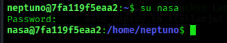   
Ahora intentamos ver los privilegios que tiene el usuario **nasa** y encontramos que podemos usar **socat** el cual permite establecer una shell interactiva cuando se configura y ejecuta adecuadamente. Podemos ayudarnos de la página de **[GTFOBins](https://gtfobins.github.io/)** para ver que podemos hacer.  
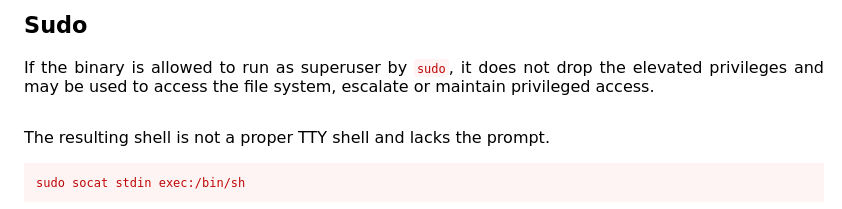  

## 🚀 Escalada de privilegios a elite
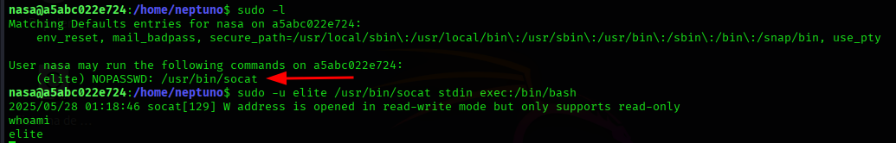  
Debemos usar `sudo -u elite` porque el comando tiene que ejecutarse como el usuario **elite**, no como usuario **root**.  
Ejecutamos un tratamiento **TTY** con `script /dev/null -c bash` para evitar errores a la hora de ejecutar comandos. El atajo `CTRL + L` no está disponible para limpiar la terminal, pero el comando `clear` sí funciona correctamente.  
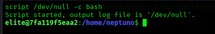  

## 👑 Escalada de privilegios a root
Volvemos a intentar ver los privilegios de usuario, en este caso del usuario **elite** y vemos como resultado que podemos ejecutar el comando `chown` como **root** sin la necesidad de contraseña. El comando `chown` se utiliza para cambiar el usuario propietario y/o el grupo propietario de un archivo o directorio específico en sistemas Unix/Linux.  
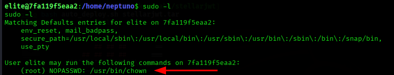  
Podemos ayudarnos de nuevo de la página **[GTFOBins](https://gtfobins.github.io/)** para ver que podemos hacer.  
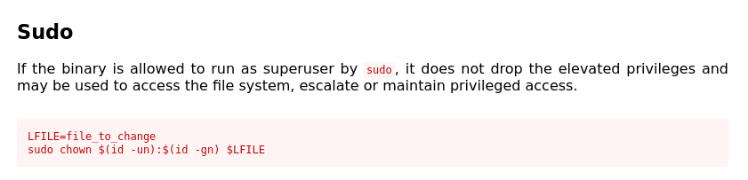  
1. Modificamos la propiedad del directorio `/etc`.  
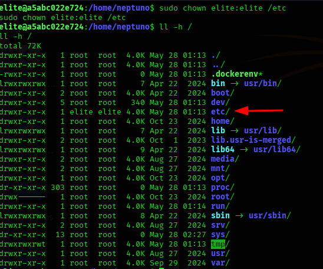  
2. Hacemos lo mismo para `/etc/passwd`.  
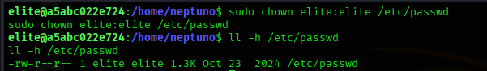  
3. Ahora ya solo queda modificar la linea **root** para quitar la `x` y así poder acceder sin la necesidad de autenticación. y para ello usamos el comando:
```bash
sed -i's/x//g' /etc
```
**Explicación:**
- `sed` Herramienta para editar texto (Stream EDitor)
- `-i` Modifica el archivo directamente (sin crear copia)
- `'s/x//g'` Instrucción de búsqueda y reemplazo

**La instrucción 's/x//g' significa:**
- `s` Sustituir
- `x` Lo que busca (la letra "x")
- `//` Lo reemplaza con nada (lo elimina)
- `g` Lo hace en toda la linea global

⚠️ **¡Atención!**
Para probar primero sin modificar el archivo podemos utilizar el comando:
```bash
sed 's/x//g' /etc
```
sin la opción `-i`, de esta forma tendremos una vista previa.  
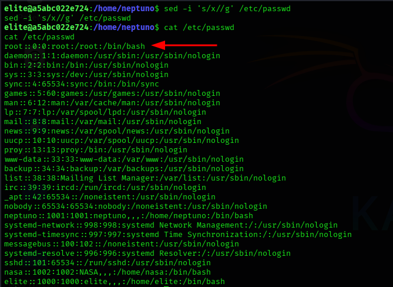  
Finalmente hemos conseguido el acceso `root`.  
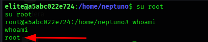  

## ✅ Conclusión
- **Acceso inicial**: Explotación de **JWT** + fuerza bruta con **Hydra** (Credenciales: `neptuno:Gottfried`).
- **Escalada**: 
    - **neptuno** → **nasa** (contraseña `Eisenhower` en `.carta_a_la_nasa.txt`). 
    - **nasa** → **elite** (abuso de **socat**  via `sudo -u elite`).
    - **elite** → **root** (modificación de **/etc/passwd** con **chown**).
- 🎯 **Objetivo obtenido**: Shell de **root** obtenida.