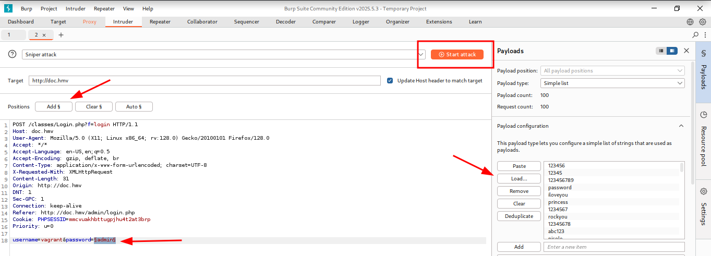
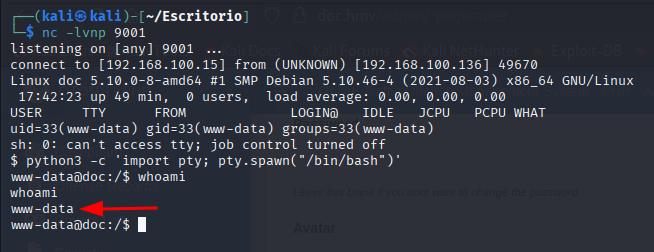
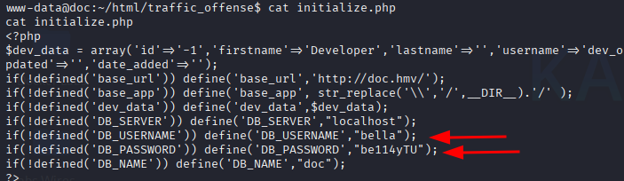
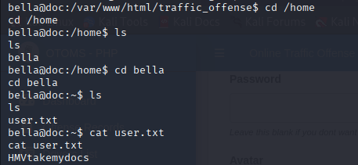
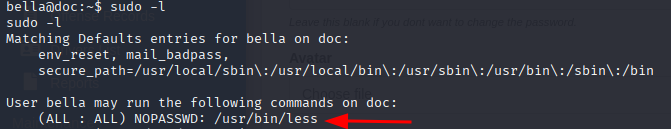
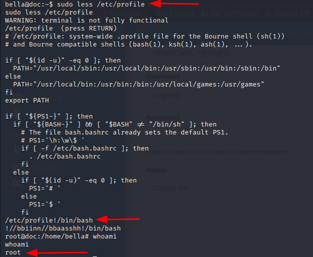
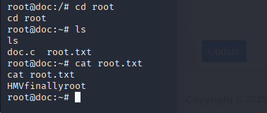

# Guía de Pentesting - Máquina 1

**Curso:** Pentesting Pro.   
**Objetivo:** Comprometer la máquina y obtener acceso root/administrador.
## 📶 Reconocimiento
1. Descubrimiento de Host con `arp-scan`  

  
- IP de maquina objetivo **192.168.100.136**  

También podemos realizar un descubrimiento del host haciendo uso del comando `nmap -sn ip`

## 🔍 Escaneo de puertos con Nmap
Realizamos un escaneo completo de puertos.  
  
Hallazgos;
- Puerto `80/tcp` **HTTP** Servicio **nginx 1.18.0**

## 🌐 Acceso al servidor web
Accedemos mediante el navegador a la dirección `192.168.100.136` y encontramos una página con un botón de login.  
  
- El botón de login redirige a `http://doc.hmv/admin`.
- Sin la resolución `DNS` adecuada, el navegador no podrá resolver `doc.hmv`.
- Al agregar la entrada al archivo `hosts`, forzamos la resolución localmente.

Para Agregarlo usamos el comando: `sudo nano /etc/hosts`.  

**Una vez agregada la entrada al archivo hosts:**
- ✅ Ya no es necesario usar la dirección IP en el navegador.
- ✅ Podemos acceder directamente mediante: `http://doc.hmv`.
- ✅ Todos los enlaces y redirecciones funcionarán correctamente.
- ✅ Las herramientas de línea de comandos también pueden usar el nombre de dominio.  

  

## ⚔️Explotación
Detección de vulnerabilidades `SQL Injection`
**Herramientas utilizadas:**
- `Burp Suite`
- Extensión de navegador (`FoxyProxy`)
**Procedimiento:**
1. Configuración de `Burp Suite:`
	- Iniciamos `Burp Suite` y configuramos el proxy en el puerto 8080.
	- Configuramos el navegador para usar el proxy local (127.0.0.1:8080).
2. Interceptación de trafico:
	- Activamos la interceptación en `Burp Suite`.
	- Intentamos iniciar sesión en el formulario de login en `http://doc.hmv/admin`.
	- `Burp Suite` captura la solicitud `POST`.
3. **Detección de vulnerabilidad:**
	- Enviamos la solicitud capturada a `Repeater` (**CTRL + R**).
	- Probamos `payloads` básicos de `SQL Injection` en los parámetros: `' OR 1=1 #`  

  
**Resultado:**  
Acceso exitoso al panel de administración.  

  
**Ubicación en el panel:**  
Después de acceder al panel de administración mediante SQL Injection, exploramos la sección "User List" donde encontramos 2 usuarios:  

  

## 🧠 Fuerza bruta con Burp Suite
**Procedimiento ejecutado:**
1. **Captura de la solicitud de autenticación:**
    - Interceptamos la solicitud de login con `Burp Suite`.
    - La solicitud la enviamos al módulo `Intruder`.
2. **Configuración de posiciones en `Intruder`:**
    - Marcamos el campo `password=admin` con la opción `Add §`.
    - El ataque se configuró como **Cluster Bomb** para probar múltiples combinaciones.
3. **Configuración de payload:**
    - **Payload:** Diccionario personalizado creado con: `head -n 100 /usr/share/wordlists/rockyou.txt > diccionario.txt`.  

  
**Procedimiento de identificación de credenciales válidas:**
1. **Ejecución del ataque:**
    - Iniciamos el ataque con el diccionario de 100 contraseñas.
    - Observamos la pestaña **Length** para identificar respuestas anómalas.
2. **Identificación de la contraseña correcta:**
    - Buscamos un valor de longitud (**Length**) diferente a los demás.
    - Al encontrar un **length** único, seleccionamos esa **request**.
    - Verificamos en la pestaña **Response** el contenido.
3. **Confirmación de éxito:**
    - La respuesta contiene: `{"status":"success"}`.
    - Esto indica autenticación exitosa.  

   
**Credenciales comprometidas:**
- Usuario: **vagrant**
- Contraseña: **chelsea**  

  

## Explotación mediante subida de Reverse Shell PHP
**Procedimiento:**
1. **Generación del código de `reverse shel`l:**
    - Accedemos a [revshells.com](https://www.revshells.com/).
    - Seleccionamos la opción "PHP PentestingMonkey".
    - Configuramos con nuestra IP.
    - Copiamos el código generado.
2. Creación del archivo `PHP`
	`nano reverse.php`
3. Configuración del Listener  

    ⚠️ **Paso critico - Antes de subir el archivo**  
    Iniciamos `netcat` en modo escucha en el puerto 9001
    `nc -lnvp 9001`

**Explicación:**
- `-l`: Modo escucha (listener).
- `-n`: No resolver nombres DNS.
- `-v`: Modo verbose (muestra conexiones entrantes).
- `-p`: Especifica el puerto (9001).
4. Subida del archivo malicioso
**Ubicación en el panel:**
- Sección **Mi cuenta** → **Cambiar avatar**.

**Procedimiento de subida:**
1. Seleccionamos el archivo `reverse.php` como nueva imagen de perfil.
2. Confirmamos la subida.
3. Observamos la respuesta del sistema.

⚠️ **Importante:** Mantener el terminal con `netcat` en escucha durante todo el proceso.

**Resultado esperado:**  
- La reverse shell se ejecutará automáticamente.
- `Netcat` recibirá la conexión entrante.
- Obtendremos acceso al sistema.  

  

## 👑 Escalada de privilegios a root
### Obtención de Credenciales y Acceso al Usuario "bella"
Durante la enumeración del sistema, se encontraron credenciales en el archivo **/var/www/html/traffic_offence/initialize.php**:  
  
**Credenciales:**  
  
DB_USERNAME = **bella**  
DB_PASSWORD = **be114yTU**  

**Verificación de la existencia del usuario "bella":**  
**cat /etc/passwd | grep "bella"**  
  
**Acceso al usuario `bella` mediante su contraseña:**  
  
- su bella
- Password: be114yTU
### Exploración del Directorio Home y Captura de la Flag
**Navegación al directorio home de `bella`:**  
  
**Contenido de user.txt:**  
Flag: **HMVtakemydocs**
### Enumeración de Privilegios de Sudo
**Ejecución de `sudo -l` para verificar privilegios:**
  
Esto indica que el usuario `bella` puede ejecutar `/usr/bin/less` como **root** sin necesidad de contraseña.
### Explotación de less para Escalada de Privilegios
**Referencia a GTFOBins:**  
Para explotar correctamente la vulnerabilidad de `less` con permisos sudo, nos apoyamos en [GTFOBins](https://gtfobins.github.io/), un recurso esencial que documenta métodos de explotación de binarios legítimos para bypass de restricciones de seguridad.  
**Método de explotación según GTFOBins:** `sudo less /etc/profile`  
- Una vez dentro de `less`, presionamos **!** para entrar en el modo de comandos.
- Escribir `bash` o `sh` y presionamos **Enter**: `!/bin/bash`.
- Esto ejecutará una shell interactiva como `root`.  

  
### Exploración del Directorio Root y Captura de la Flag
**Navegación al directorio root de root:**  
  
**Contenido de root.txt:**
Flag: **HMVfinallyroot**  

## ✅ Conclusión
- **Acceso inicial**: Explotación de `SQL Injection` en formulario de login + subida de `reverse shell PHP` mediante función de cambio de avatar.
- **Escalada de privilegios**:
    - Usuario web → `vagrant` (fuerza bruta con `Burp Suite` - contraseña débil).   
    - `vagrant` → `bella` (credenciales DB en `/var/www/html/traffic_offence/initialize.php`: `bella:be114yTU`).   
    - `bella` → `root` (abuso de `sudo /usr/bin/less` mediante técnica de **GTFOBins**).    
- 🎯 **Objetivo obtenido**: Shell de `root` obtenida con acceso completo al sistema.